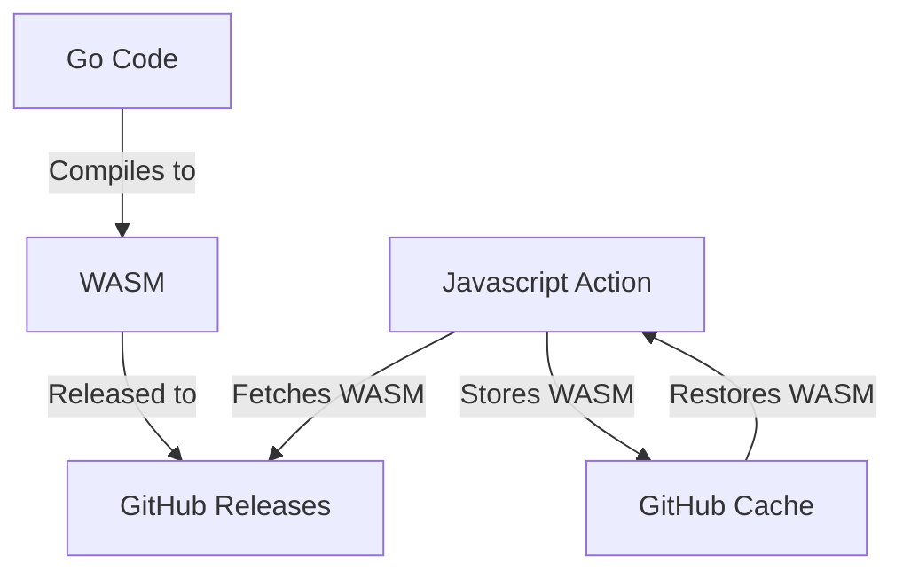

# Go GitHub Action Toolkit

A framework for writing GitHub Actions in Go.

This toolkit contains all the commands, libraries, and scripts required to
convert Go code into workable GitHub Actions.

## Tour

* [🎓 Tutorials](./docs/tutorials/)
  * [🚀 Getting Started](./docs/tutorials/getting-started.md)
* [🔍 How it works](#how-it-works)
* [💼 License](#license)

## How It Works

[Go] code is compiled into [WASM], and releases/hosted in the corresponding
Action's [GitHub Releases] as a Release Asset. These releases can be
downloaded by the [JavaScript Action] and executed. Optionally, the downloaded
WASM may be cached in the [GitHub Cache] for faster executions.

See the below diagram:

[Go]: https://go.dev
[WASM]: https://webassembly.org/
[GitHub Releases]: https://docs.github.com/en/repositories/releasing-projects-on-github
[JavaScript Action]: https://docs.github.com/en/actions/creating-actions/creating-a-javascript-action

## License

This project is [dual-licensed] under both [MIT] and [Apache-2], at the
discretion of the user.

[dual-licensed]: https://en.wikipedia.org/wiki/Multi-licensing
[MIT]: https://opensource.org/license/mit
[Apache-2]: https://opensource.org/license/apache-2-0
